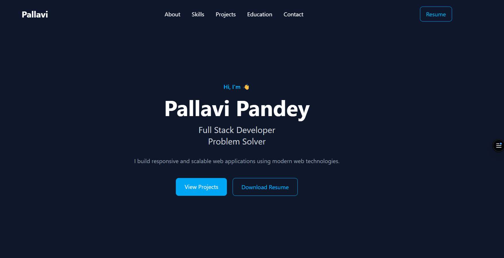

# 🌐 Pallavi Pandey - Portfolio

A modern, responsive, and interactive developer portfolio showcasing my skills, projects, and journey as a Full Stack Developer.

## 🚀 Live Demo

🔗 **Portfolio:** https://portfolio-iw5m.vercel.app/


---

## ✨ Features

- 🎨 Modern UI with Tailwind CSS
- 📱 Fully Responsive Design
- ⚡ Smooth Scroll Navigation
- 🎬 Framer Motion Animations
- 💼 Projects Showcase
- 🛠️ Technical Skills Section
- 🎓 Education Section
- 📩 Functional Contact Form using EmailJS
- 📄 Resume Download
- 🌙 Dark Theme

---

## 🛠️ Tech Stack

### Frontend

- React
- TypeScript
- Vite
- Tailwind CSS
- Framer Motion

### Backend Services

- EmailJS

### Tools

- Git
- GitHub
- VS Code

---

## 📂 Folder Structure

```text
src
│
├── assets
├── components
│   ├── Motion
│   └── Navbar
│
├── data
│   ├── projects.ts
│   └── skills.ts
│
├── sections
│   ├── Hero
│   ├── About
│   ├── Skills
│   ├── Projects
│   ├── Education
│   ├── Contact
│   └── Footer
│
├── App.tsx
└── main.tsx
```

---

## 📸 Portfolio Preview

Add a screenshot here after deployment.

Example:

```
public/portfoliopreview.png
```

Then:


## 📸 Portfolio Preview




---

## 💻 Installation

Clone the repository

```bash
git clone https://github.com/pallavics26/Portfolio.git
```

Navigate to the project

```bash
cd Portfolio
```

Install dependencies

```bash
npm install
```

Start the development server

```bash
npm run dev
```

Build for production

```bash
npm run build
```

---

## 📬 Contact

📧 Email

**pallavipandey.2511@gmail.com**

💼 LinkedIn

https://www.linkedin.com/in/pallavipcs27/

🐙 GitHub

https://github.com/pallavics26

---

## 📄 Resume

Download my latest resume directly from the portfolio website.

---

## 📌 Future Improvements

- Blog Section
- Experience Timeline
- Certifications
- Light/Dark Theme Toggle
- More Animations
- Project Filtering

---

## ⭐ If you like this project

Please consider giving it a ⭐ on GitHub.

---

## 👩‍💻 Author

**Pallavi Pandey**

Full Stack Developer

GitHub: https://github.com/pallavics26

LinkedIn: https://www.linkedin.com/in/pallavipcs27/
